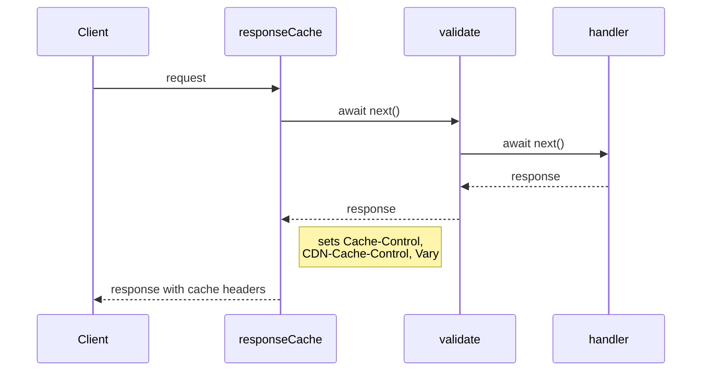
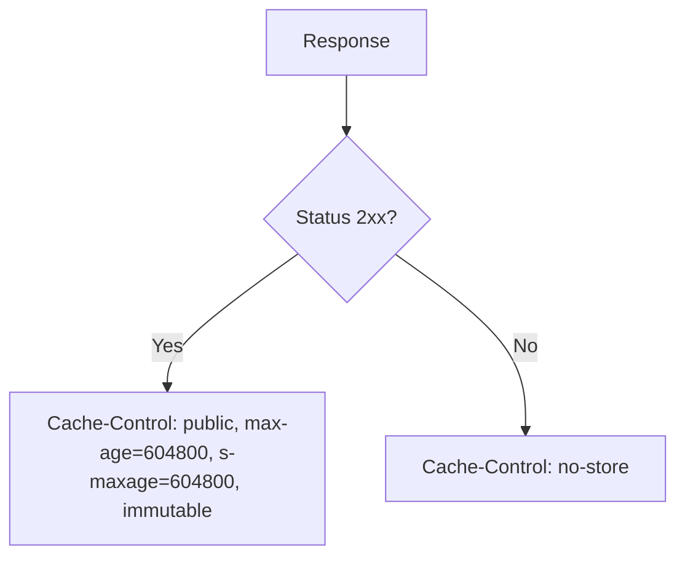

# Response Cache Middleware

Hono middleware that sets `Cache-Control`, `CDN-Cache-Control`, and `Vary` headers on responses. Targets both browser and CDN caching (CloudFront / Cloudflare). All header values are computed once at middleware creation time, not per-request.

**Source:** `src/lib/hono/middlewares/response-cache.ts`

## Usage

```ts
import { responseCache } from '@/lib/hono/middlewares/response-cache';

app.get('/assets/*', responseCache('infinite'), handler);
app.get('/health', responseCache('never'), handler);
app.get('/feed', responseCache({ maxAge: 60, sMaxAge: 300, staleWhileRevalidate: 120 }), handler);
```

## Middleware Ordering

`responseCache` sets headers **after** `await next()`. In Hono's onion model, the first middleware in the chain executes last on the response path. Place `responseCache` **first** in the per-route chain to guarantee it has the final say on cache headers.



```ts
// correct — responseCache is first, sets headers last
app.get('/data', responseCache('infinite'), requestValidate('query', schema), handler);

// incorrect — requestValidate runs after, could overwrite headers
app.get('/data', requestValidate('query', schema), responseCache('infinite'), handler);
```

## Presets

| Preset         | `Cache-Control`                                         | `CDN-Cache-Control`                 | `Vary`          | `Pragma` / `Expires` |
| -------------- | ------------------------------------------------------- | ----------------------------------- | --------------- | -------------------- |
| `'infinite'`   | `public, max-age=604800, s-maxage=604800, immutable`    | `public, max-age=604800, immutable` | `Authorization` | -                    |
| `'revalidate'` | `no-cache, must-revalidate, proxy-revalidate`           | `no-cache, must-revalidate`         | `Authorization` | -                    |
| `'never'`      | `no-store, no-cache, must-revalidate, proxy-revalidate` | `no-store`                          | -               | `no-cache` / `0`     |

### `'infinite'`

Caches the response for 7 days (604800 seconds) in both browser and CDN with `immutable`. Use for content-addressed assets where the URL changes when content changes (hashed filenames, versioned URLs).

**2xx guard:** only applied to successful responses (status 200-299). Non-2xx responses receive `Cache-Control: no-store` and `CDN-Cache-Control: no-store` to prevent caching error pages at the CDN edge, which would require manual invalidation to recover.



### `'revalidate'`

Forces both browser and CDN to check with the origin on every request. The response may be stored but is always considered stale. Use for data that changes unpredictably but benefits from conditional requests (304 Not Modified).

### `'never'`

Prevents caching entirely. Adds legacy `Pragma: no-cache` and `Expires: 0` headers for older proxy compatibility. Use for sensitive data, health checks, or responses that must never be served from cache.

## Custom Options

Pass an object for fine-grained control over individual directives.

```ts
responseCache({
  maxAge: 60,
  sMaxAge: 300,
  staleWhileRevalidate: 120,
  staleIfError: 3600,
});
// Cache-Control: public, max-age=60, s-maxage=300, stale-while-revalidate=120, stale-if-error=3600
// CDN-Cache-Control: max-age=300, stale-while-revalidate=120, stale-if-error=3600
```

### Options Reference

| Option                 | Type       | Default             | HTTP Directive           | Description                                  |
| ---------------------- | ---------- | ------------------- | ------------------------ | -------------------------------------------- |
| `maxAge`               | `number`   | -                   | `max-age`                | Browser cache lifetime in seconds            |
| `sMaxAge`              | `number`   | -                   | `s-maxage`               | CDN / shared cache lifetime in seconds       |
| `staleWhileRevalidate` | `number`   | -                   | `stale-while-revalidate` | Serve stale while revalidating in background |
| `staleIfError`         | `number`   | -                   | `stale-if-error`         | Serve stale when origin errors               |
| `private`              | `boolean`  | `false`             | `private` / `public`     | Restrict to browser only (no CDN)            |
| `noTransform`          | `boolean`  | -                   | `no-transform`           | Prevent intermediary alterations             |
| `mustRevalidate`       | `boolean`  | -                   | `must-revalidate`        | Browser must revalidate when stale           |
| `proxyRevalidate`      | `boolean`  | -                   | `proxy-revalidate`       | CDN must revalidate when stale               |
| `immutable`            | `boolean`  | -                   | `immutable`              | Response body will never change              |
| `vary`                 | `string[]` | `['Authorization']` | `Vary`                   | Request headers to vary on                   |

### Vary

All presets (except `'never'`) and custom options default to `Vary: Authorization`. Override with the `vary` option:

```ts
// multiple vary headers
responseCache({ maxAge: 60, vary: ['Authorization', 'Accept-Language'] });

// no Vary header
responseCache({ maxAge: 60, vary: [] });
```

Query string variance cannot be controlled via the `Vary` header — it is a CDN distribution-level setting (CloudFront cache policy / Cloudflare cache rules).

## CDN Behavior

### Headers Emitted

| Header               | Target         | Notes                                                                                       |
| -------------------- | -------------- | ------------------------------------------------------------------------------------------- |
| `Cache-Control`      | Browser + CDN  | Standard header. `max-age` for browser, `s-maxage` for CDN                                  |
| `CDN-Cache-Control`  | Cloudflare     | Edge-specific override. Uses `max-age` (not `s-maxage`) since the header itself is CDN-only |
| `Vary`               | Browser + CDN  | Separate cache entries per unique header combination                                        |
| `Pragma` / `Expires` | Legacy proxies | Only set for `'never'` preset                                                               |

### CloudFront

CloudFront does not have a proprietary cache header. It reads `s-maxage` from the standard `Cache-Control` header directly. The `CDN-Cache-Control` header is ignored by CloudFront.

### Cloudflare

Cloudflare reads both `Cache-Control` and `CDN-Cache-Control`. When `CDN-Cache-Control` is present, it takes precedence over `s-maxage` in `Cache-Control` for edge caching decisions.

### Custom Options — CDN-Cache-Control

`CDN-Cache-Control` is only emitted for custom options when `sMaxAge` is provided. Without `sMaxAge`, the CDN falls back to reading `Cache-Control` directly.

```ts
// emits CDN-Cache-Control: max-age=300
responseCache({ maxAge: 60, sMaxAge: 300 });

// no CDN-Cache-Control emitted
responseCache({ maxAge: 60 });
```
